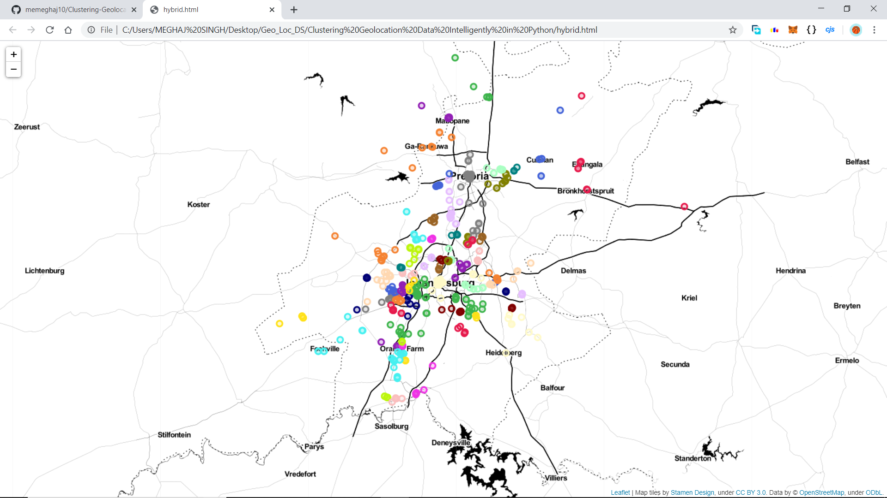
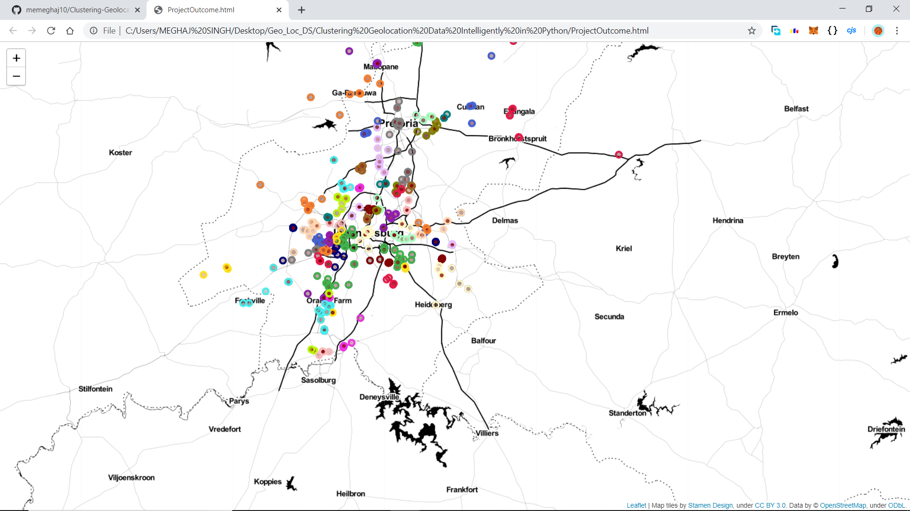

# Clustering-Geolocation-Data-Intelligently-in-Python

This is Coursera Guided Project completed by me with the following learning objectives:-

1. How to visualize and understand geographical data in an interactive way with Python.

2. How the K-Means algorithm works, and some of the shortcomings it has.

3. Density-based clustering approaches, and how to deal with any outliers they may classify.

Initially the project was completed by me on the Coursera's hands-on platform "Rhyme", but later I downloaded ht Jupyter Notebook and saved my progress.

Following python modules/functions have been used in the project:-

1. `matplotlib` for plots and charts visualization of the outcomes.

2. `Pandas` for storing and manipulating data.

3. `Numpy` for its use in data-manipulation.

4. `hdbscan` and `DBSCAN` for spatial-clusterings (hierarchichal).

5. `sklearn` functionalities like `Kmeans` and `silhouette_score` with `KneighboursClassifier`.

6. `folium` for maps and co-ordinates visualization.

## The Project has been divided into 7-tasks:-

Task 1: An introduction to the problem, as well as basic exploratory data analysis and visualizations.

Task 2: Visualizing geographical data in a more meaningful and interactive way.

Task 3: Methods of evaluating the strength of a clustering algorithm.

Task 4: Theory behind K-Means, and how to use it for our problem.

Task 5: Introduction to density-based clustering approaches, and how to use DBSCAN.

Task 6: Introduction to HDBSCAN, to alleviate constraints of classical DBSCAN.

Task 7: A simple method to address outliers classified by density-based models.

At the end of this Project I found out that I need to work more on :-

1. `K-Means` Algorithm.

2. `Density-based clustering` approaches with `HDBSCAN`.

3. A little bit of `DataVisualization` skills.
